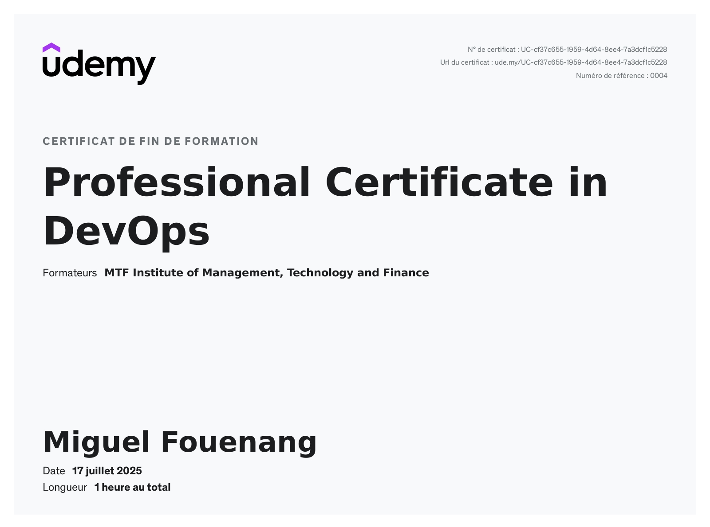

DevOps Fundamentals Accelerator
==============================

🚀 1-hour intensive course covering core DevOps concepts, tools, and workflows.
Certified by MTF Institute of Management, Technology and Finance
[Certificate Verification](https://ude.my/UC-cf37c655-1959-4d64-8ee4-7a3dcf1c5228)

Key Learnings
-------------

1. DevOps Philosophy
   - Culture of collaboration between Dev & Ops teams
   - Continuous Delivery (CD) principles
   - Automation mindset for faster deployments
   - Benefits: Faster releases, improved reliability, reduced errors

2. Version Control with Git
   • Essential Commands:
        git clone <repo>       # Clone repository
        git checkout -b feat   # Create feature branch
        git commit -am "msg"   # Commit changes
        git push origin feat   # Push to remote
        git merge feat         # Merge to main

   • Workflow Practices:
        - Branching strategies
        - Pull requests & code reviews
        - Issue tracking workflows

3. CI/CD Pipelines
   • Tools Comparison:
        | Tool           | Best For                          |
        |----------------|-----------------------------------|
        | Jenkins        | Customizable complex pipelines    |
        | GitHub Actions | Cloud-native GitHub projects      |
        | GitLab CI/CD   | Integrated GitLab solutions       |

   • Key Concepts:
        - YAML pipeline configuration
        - Automated testing/deployment
        - Reduced manual intervention

4. Containerization with Docker
   • Sample Dockerfile:
        FROM alpine:latest
        COPY app.py /app
        CMD ["python", "/app/app.py"]

   • Essential Commands:
        docker build -t myapp .   # Build image
        docker run -d myapp       # Run container
        docker ps                 # List running containers

   • Benefits:
        - Container vs VM differences
        - Image management best practices
        - Portability across environments

5. Configuration Management (Ansible)
   • Sample Playbook (playbook.yml):
        - name: Configure web server
          hosts: webservers
          tasks:
            - name: Install nginx
              apt: name=nginx state=present

   • Key Features:
        - Idempotent infrastructure
        - Playbook structure
        - Inventory management

6. Monitoring Stack
   • Tools Overview:
        | Tool        | Primary Function                 |
        |-------------|----------------------------------|
        | Prometheus  | Metrics collection & alerting    |
        | Grafana     | Visualization & dashboards       |

   • Key Metrics:
        - System uptime
        - Application performance
        - Resource utilization

Hands-On Projects
-----------------
1. Git Workflow Simulation: Team collaboration repository
2. Dockerized Microservice: Containerized Python/Node.js application
3. CI/CD Pipeline: Automated testing with GitHub Actions
4. Infrastructure Playbook: Web server provisioning with Ansible

Next Steps
----------
[ ] Deep dive into Kubernetes orchestration
[ ] Implement Terraform for Infrastructure as Code (IaC)
[ ] Build cloud-native apps on AWS/Azure/GCP
[ ] Earn CKA/CKAD certifications

Quote from Instructor
---------------------
"DevOps isn't a destination – it's a journey of continuous improvement."
– Miguel Fouemang

Connect & Resources
-------------------
• Email: miguelfouenanf@gmail.com
• Full Course Notes: [My Personal DevOps Course PDF](link-to-your-pdf)
• MTF Institute: https://mtf-institute.com
